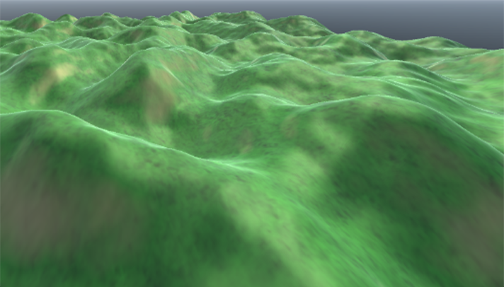
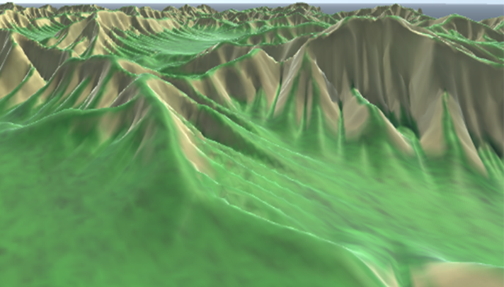
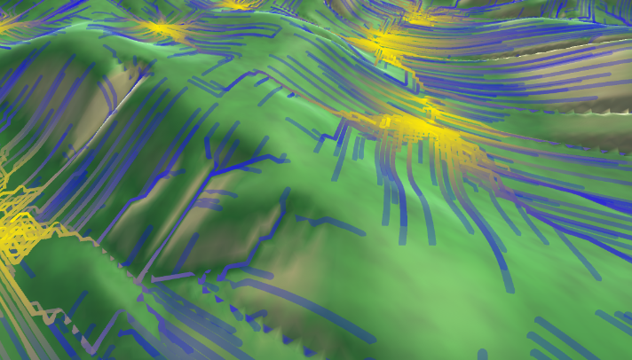

# Hydraulic Erosion Terrain Simulation

A Unity project that generates procedural terrain and applies particle-based hydraulic erosion in real time.

## **Overview**

This demo generates a procedural terrain mesh of a specific resolution and simulates hydraulic erosion across its surface. The terrain begins as a noise based height mesh before spawning water particles at high points on the mesh. They then move downhill, carve into the terrain, carry sediment, and deposit material as they travel.

I've included runtime controls for tuning the erosion effect, pausing the simulation, stepping it manually, resetting the terrain, and visualizing particle flow paths.

## Features

1. Procedural terrain mesh generation using layered Perlin noise

2. Particle-based hydraulic erosion simulation

3. Runtime UI for adjusting erosion settings

4. Pause, resume, step, and reset controls

5. Particle path visualization using LineRenderer

6. Free camera movement for inspecting terrain details

7. Adjustable erosion strength, deposit amount, water amount, droplet count, flow length, and simulation speed

### Intial Generated Terrain

### Eroded Terrain

### Particle Path Tracking Visualization

## Controls

### Camera
C - Toggle movement

WASD - Move

Mouse - Look

Space - Translate up

Left Ctrl - Translate down

Left Shift - Move faster

### UI Buttons
Pause / Resume - Pauses or resumes simulation

Step Simulation - Advances the simulation manually by one frame

Reset - Restores the terrain to its original pre-eroded state

Show Paths - Toggles particle path visualizer
